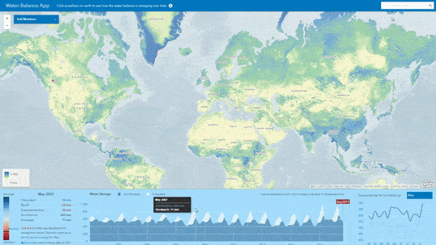

# Water Balance App

The [Water Balance App](https://livingatlasdev.arcgis.com/waterbalance/) is a web based mapping application that is used to explore and visualize the worldwide climate data that have been collected since January 2000 to present, this climate record is maintained by NASA through it's Global Land Data Assimilation System ([GLDAS](https://ldas.gsfc.nasa.gov/)), and is updated each month as new data becomes available.. Learn more [here](https://blogs.esri.com/esri/arcgis/2017/09/25/explore-climate-trends-with-the-water-balance-app/).

[View it live](https://livingatlasdev.arcgis.com/waterbalance/)

## Features
* Click anywhere on the map to see how a chosen variable has changed over time, and click anywhere on the main graph (on the center) to switch the map to that month of interest.
* The water balance panel (on the left) shows how much recharge or depletion occurred during your chosen month, and how this compares to what’s normal.
* The trend analyzer panel (on the right) shows how your chosen variable was different in the same month during other years. This panel also allows you to see the seasonal variation during a normal year (by graphing the average for each month) or aggregate the time series into annual time steps to see the long term trend more clearly.

## Instructions

1. Fork and then clone the repo. 
2. Navigate to the home directory of the repo on your local machine with the web server running and view the app

## Requirements

- [ArcGIS API for JavaScript (version 3.20)](https://developers.arcgis.com/javascript/index.html)
- [D3.js (version 3)](https://d3js.org/)
- [jQuery](http://jquery.com/)
- [Moment.js](http://momentjs.com/)

## Resources

* Five variables from GLDAS are available as image services through [ArcGIS Living Atlas of the World](https://livingatlas.arcgis.com/en/#s=0&q=gldas): precipitation, runoff, evapotranspiration, soil moisture, and snowpack.
* [NASA's Global Land Data Assimilation System](https://ldas.gsfc.nasa.gov/)
* [Noah land surface model](https://www.jsg.utexas.edu/noah-mp)
* [Water Balance App Blog Post](https://blogs.esri.com/esri/arcgis/2017/09/25/explore-climate-trends-with-the-water-balance-app/)

## Issues

Find a bug or want to request a new feature?  Please let us know by submitting an issue.

## Contributing

Esri welcomes contributions from anyone and everyone. Please see our [guidelines for contributing](https://github.com/esri/contributing).

## Licensing
Copyright 2016 Esri

Licensed under the Apache License, Version 2.0 (the "License");
you may not use this file except in compliance with the License.
You may obtain a copy of the License at

   http://www.apache.org/licenses/LICENSE-2.0

Unless required by applicable law or agreed to in writing, software
distributed under the License is distributed on an "AS IS" BASIS,
WITHOUT WARRANTIES OR CONDITIONS OF ANY KIND, either express or implied.
See the License for the specific language governing permissions and
limitations under the License.

A copy of the license is available in the repository's [license.txt](license.txt) file.
